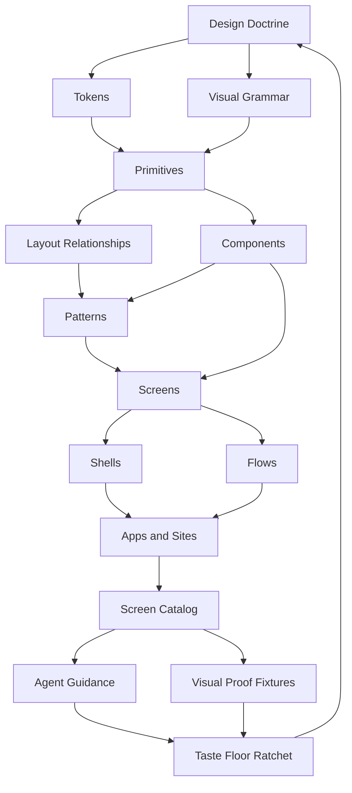

# PLAN: Visual Taste Floor Saga

Status: active plan
Date: 2026-05-23
Trigger: Chirp UI can produce correct, inspectable interfaces, but quick
prototypes still too often look like neutral wireframes instead of designed
product surfaces. The project needs a deliberate taste floor that is authentic
to Chirp UI instead of a shadcn/ui, Bootstrap, Bulma, or Tailwind UI imitation.

## Mission

Raise Chirp UI's default visual floor so a serious app mock looks composed,
specific, and product-ready before the app author writes custom CSS.

The goal is not decoration. The goal is a layered system where primitives,
components, patterns, screens, shells, flows, themes, fixtures, docs, and agent
guidance all reinforce the same visual point of view:

> Chirp UI makes inspectable Python apps feel composed, operational, and alive.

## Problem Statement

Chirp UI has a strong contract floor:

- components are registry-described,
- emitted classes are cited and tested,
- CSS is generated from partials,
- theme packs are token-only,
- authoring avoids utility-class vocabulary,
- docs and manifests can ground agents.

That is not the same as a taste floor.

When an agent freehands static HTML and CSS, it can optimize directly for the
screen: custom spacing, one-off hero treatment, expressive surfaces, tailored
typography, and local visual hierarchy. Chirp UI intentionally makes those
moves more expensive because they must pass through tokens, primitives,
components, generated docs, and tests.

This saga makes the correct path the beautiful path by adding a screen and
composition layer above the current component system.

## Non-Goals

- Do not add Tailwind-compatible utilities, Skeleton aliases, or shorthand
  spacing/color class vocabularies.
- Do not add public shell or screen macros before repeated recipes prove a
  stable contract.
- Do not turn theme packs into component skins with `.chirpui-*` selectors.
- Do not copy shadcn/ui anatomy, Tailwind UI page sections, or Bootstrap/Bulma
  surface language as default Chirp UI taste.
- Do not use static showcase fixtures as proof for new public APIs unless the
  same need appears in realistic app or site compositions.
- Do not add manifest schema fields for screens, profiles, or taste laws until
  a concrete generated-output consumer exists.

## Taste Thesis

Chirp UI should not look generic because its architecture is not generic.

The visual identity should come from the same ideas as the library:

- **Inspectable structure:** hierarchy is clear because ownership is clear.
- **Operational calm:** dense pages feel organized, not cramped.
- **State as design material:** pending, stale, selected, verified, failed, and
  dangerous states are first-class visual objects.
- **Metadata dignity:** provenance, counts, timestamps, owners, runtime, and
  status read as designed information, not leftover labels.
- **Layered work surfaces:** rails, command rows, panels, inspectors, overlays,
  and content regions communicate relationship and scope.
- **Token-driven mood:** color, radius, elevation, density, motion, and type
  form coherent profiles without component-specific skins.
- **Agent-copyable composition:** agents choose a complete product situation
  before choosing individual components.

## Composition Taxonomy

This taxonomy names the layers that must agree before the taste floor is real.

## Layer Definitions

| Layer | Owns | Current Status | Taste-Floor Gap |
|---|---|---|---|
| Design doctrine | The visual point of view and taste laws. | Implicit in vision, primitives, relationship contracts, and theme docs. | Needs a short explicit doctrine that agents can apply. |
| Tokens | Color, type, radius, elevation, motion, spacing, density. | `atlas`, `ember`, `sage`, app starter, and token docs exist. | Profiles need visual intent, use cases, anti-use cases, and screenshots. |
| Visual grammar | Rules for surfaces, hierarchy, state, metadata, and density. | Scattered across primitive, relationship, visual audit, and app chrome docs. | Needs one canonical taste checklist. |
| Primitives | Layout composition and rhythm. | `stack`, `cluster`, `grid`, `frame`, `block`, `container`, `layer`, `flow`, `actions`, `prose`. | Need clearer mapping from product situations to primitive compositions. |
| Components | Concrete UI objects and interaction contracts. | Broad registry-backed component vocabulary. | Default compositions can still feel generic without screen-level recipes. |
| Typography roles | Semantic type jobs for structure, reading, metadata, controls, state, data, technical output, and expressive moments. | UI, prose, and code scales exist; research synthesis lives in `docs/decisions/typography-rhythm-taste-floor.md`. | Need screen-proven role bundles before public token promotion. |
| Layout relationships | Attached, grouped, inset, separated, selected, local overflow, pressure. | Relationship contracts and layout-affinity recipes exist. | Need visual proof that relationships create polish by default. |
| Patterns | Reusable arrangements such as filter rail plus results plus inspector. | Product, media, forum, search, dense navigation, and workspace recipes exist. | Need stronger screen archetype mapping and canonical screenshots. |
| Screens | Complete product situations with realistic data and states. | Not yet a first-class catalog surface. | This is the main missing layer. |
| Shells | Persistent app/site environments and navigation frames. | App shell, workspace shell, site shell, Bengal docs shell, and recipe-first chrome guidance exist. | Need shell/screen boundaries and no premature mega-shell macro. |
| Flows | Multi-step journeys such as setup, approval, import, triage, recovery. | Some components exist, but flow recipes are thin. | Need stateful screen sequences, not isolated pages. |
| Catalog | Public taste source with screenshots, recipes, source, data, and proof. | Visual audit showcase exists as a component/system audit. | Need a screen catalog for product situations. |
| Agent guidance | Copyable selection rules for agents. | Manifest and source inventory ground components. | Agents need screen-choice memory and anti-patterns. |
| Proof fixtures | Rendered evidence at desktop, tablet, and phone widths. | Browser/static visual audit practice exists. | Need golden screen fixtures and screenshot review gates. |

## Taste Laws

These laws should be used when designing screens, reviewing examples, and
deciding whether to promote a pattern.

1. **Structure before decoration.** If a screen looks flat, add clearer
   relationship and hierarchy before adding ornament.
2. **State is visible and useful.** Pending, stale, selected, verified, failed,
   empty, loading, and dangerous states should be visually distinct without
   relying on color alone.
3. **Metadata is part of the composition.** Counts, owners, timestamps,
   provenance, runtimes, and routes need deliberate placement and rhythm.
4. **Dense does not mean cramped.** High-information pages should use compact
   typography, rails, panels, and grouping without text touching decorative
   edges or controls collapsing unpredictably.
5. **Panels imply ownership.** A bordered or elevated region owns its internal
   inset, rhythm, headings, actions, and overflow.
6. **Agents start from situations.** A mock should begin with a screen archetype
   and profile, not a pile of cards and buttons.
7. **Profiles carry mood, not skins.** Theme profiles set tokens and guidance;
   they do not fork component CSS.
8. **Recipes precede APIs.** A beautiful repeated composition earns promotion
   only after independent screen usage shows the contract.
9. **Screens prove the system.** Isolated component examples are not enough to
   claim a taste floor.
10. **The default path must look finished.** If a reasonable composition needs
    page-local CSS to avoid looking like a wireframe, that is evidence for a
    token, relationship, pattern, recipe, or component improvement.

## Screen Profiles

Profiles combine token packs, visual guidance, and canonical screens. They are
not component skins.

| Profile | Use For | Mood | Initial Screens | Avoid |
|---|---|---|---|---|
| `atlas` | Operational SaaS, admin, infrastructure, dashboards. | Precise, cool, durable, high-signal. | Command Center, Data Index, Resource Detail. | Editorial marketing pages and playful onboarding. |
| `sage` | Review, planning, knowledge, low-glare work. | Calm, reflective, low-noise, readable. | Review Queue, Inbox/Triage, Project Workspace. | High-energy launch pages or urgent incident dashboards. |
| `ember` | Product, docs, editorial, launch, storytelling. | Warm, confident, narrative, polished. | Product Home, Docs Home, Customer Story Strip. | Dense operator consoles. |
| `signal` | Agents, automation, queues, observability, streaming state. | Live, technical, status-rich, legible. | Agent Run Monitor, Automation Queue, Incident Timeline. | Static brochure pages. |

Profile work must extend `docs/decisions/theme-pack-catalog.md` and
`docs/theming/app-theme.md` rather than creating a separate theme system.

## Golden Screen Set

The first taste-floor milestone should build four golden screens. These are the
minimum proof set because they cover app, review, agent, and site contexts.

| Screen | Profile | Purpose | Must Prove |
|---|---|---|---|
| Command Center | `atlas` | Executive/operator dashboard with metrics, queues, alerts, and recent activity. | Dense app surfaces can look designed without generic card grids. |
| Review Queue | `sage` | Filter rail, result collection, selected object inspector, batch actions. | Relationship ownership can produce polished work surfaces. |
| Agent Run Monitor | `signal` | Live run status, timeline, logs, artifacts, retries, and error recovery. | State, provenance, and streaming-ish data can be beautiful. |
| Product/Docs Home | `ember` | Product identity, proof, docs entry points, feature sections, CTA. | Chirp UI can produce a first-viewport page that does not feel like a wireframe. |

Each golden screen needs realistic content, long labels, empty/loading/error
states, desktop/tablet/phone proof, and no utility-style local CSS.

## Saga Epics

### Epic 1. Doctrine And Taxonomy

Goal: make the taste system explicit enough that maintainers and agents can
reason about it.

Tasks:

- T1.1: Add this plan and map it in `docs/INDEX.md` and
  `docs/strategy/roadmap-pre-1.0.md`.
- T1.2: Extract the taste laws into a durable doc after the first golden
  screen validates them.
- T1.3: Inventory existing primitives, components, patterns, shells, theme
  packs, and visual-audit fixtures against the taxonomy.
- T1.4: Mark ambiguous layers as recipe-only, experimental, or not-now before
  agents treat them as stable public API.
- T1.5: Add a short "choose a screen first" rule to agent-facing docs after
  the first catalog entries exist.

Acceptance:

- A contributor can place any visual change in the taxonomy.
- The docs index links the plan as active.
- No new public API is implied by the taxonomy alone.

Proof:

- `uv run pytest tests/docs_contracts/test_docs_ia_ratchets.py -q`
- Additional docs contract tests only if new stable docs are added.

### Epic 2. Profile System

Goal: make theme profiles strong enough to carry a mock without component
skins.

Tasks:

- T2.1: Audit existing `atlas`, `ember`, and `sage` token packs against the
  profile table in this plan.
- T2.2: Decide whether `signal` is a new pack, an app-starter variant, or a
  deferred profile until agent-run screens prove it.
- T2.3: Add profile intent, use cases, anti-use cases, and screenshot links to
  theme docs after visual proof exists.
- T2.4: Ensure each profile covers light, dark, and system branches.
- T2.5: Keep the token-only scanner rejecting `.chirpui-*` selectors in theme
  packs.
- T2.6: Add a profile comparison row to the visual audit showcase when the
  golden screens are ready.

Acceptance:

- Profiles are discoverable without reading CSS.
- Profiles carry mood through tokens, not component overrides.
- Each profile maps to at least one golden screen.

Proof:

- `uv run pytest tests/test_theme_token_parity.py tests/test_css_syntax.py -q`
- `uv run pytest tests/test_visual_audit_showcase.py -q` when showcase content changes.
- Browser proof when token changes affect layout, contrast, or density.

### Epic 3. Screen Catalog Architecture

Goal: define the public shape of screen entries without creating premature
screen macros.

Tasks:

- T3.1: Create a `docs/screens/` section only after the first two golden screens
  have source fixtures.
- T3.2: Define a screen entry template:
  - when to use,
  - when not to use,
  - profile,
  - composition map,
  - data shape,
  - states,
  - source template,
  - proof checklist,
  - agent guidance.
- T3.3: Decide whether screen metadata lives only in docs initially or has a
  Python data shape later.
- T3.4: Keep screen entries recipe-first until repeated implementation proves a
  public macro or descriptor field.
- T3.5: Add docs index and site source entries only after the section has at
  least two screen pages.

Acceptance:

- A screen entry is copyable as a recipe, not a new API.
- The entry names the profile and composition rather than raw class lists.
- The entry identifies what realistic content stress it has survived.

Proof:

- Docs IA tests when `docs/screens/` is added.
- Render/browser tests for source fixtures before public screen pages are
  promoted.

### Epic 4. Golden Screen Implementation

Goal: build the first four screens as visual anchors.

Tasks:

- T4.1: Build the Command Center fixture with metrics, queues, activity,
  alerts, long labels, and empty/loading states.
- T4.2: Build the Review Queue fixture with filter rail, result collection,
  selected object inspector, batch actions, and no horizontal overflow.
- T4.3: Build the Agent Run Monitor fixture with status timeline, logs,
  artifacts, retry controls, and error recovery.
- T4.4: Build the Product/Docs Home fixture with first-viewport identity,
  proof, entry points, and CTA without marketing-card clutter.
- T4.5: Capture desktop, tablet, and phone screenshots or browser proof for
  each fixture.
- T4.6: Record every local CSS workaround as evidence for a missing token,
  primitive, relationship, or pattern.

Acceptance:

- Each screen looks finished with packaged Chirp UI CSS plus the selected
  token profile.
- No screen uses utility-like class vocabulary as the normal authoring path.
- Each screen includes at least populated, loading, empty, and error or
  degraded states where relevant.
- Screens survive realistic data, not lorem ipsum-only content.

Proof:

- Focused render tests for fixture output.
- Browser tests for overflow and responsive framing.
- Visual audit or screenshot review at 1440, 1024, 768, 390, and 320 widths.

### Epic 5. Pattern Extraction

Goal: promote only reusable semantic moves that the golden screens prove.

Likely candidates:

- `screen_header`
- `object_inspector`
- `status_timeline`
- `artifact_strip`
- `review_queue_shell`
- `activity_rail`
- `proof_band`
- `workspace_summary`
- `state_stack`
- `metadata_bar`

Tasks:

- T5.1: For each candidate, record the exact duplication across screens.
- T5.2: Keep one-off visual fixes inside the screen recipe.
- T5.3: Before promotion, decide whether the candidate is a primitive,
  component, pattern doc, app-shell recipe, or theme token.
- T5.4: For promoted components, update descriptor, template, CSS partial,
  registry emits, generated CSS, manifest, docs, examples, and tests together.
- T5.5: For recipe-only patterns, add agent guidance but no public macro.

Acceptance:

- Promotion removes real duplication or prevents repeated bad composition.
- Promoted vocabulary is semantic, not visual shorthand for CSS properties.
- Public API changes pass stop-and-ask review.

Proof:

- `uv run pytest tests/test_template_css_contract.py tests/test_registry_emits_parity.py -q`
- `uv run poe build-css-check`
- `uv run poe build-manifest-check`
- Generated docs checks when component options change.

### Epic 5a. Typography And Rhythm Taste Floor

Goal: make the golden screens look designed through role-based typography,
rhythm, measure, and emphasis before adding any new public typography surface.

Tasks:

- T5a.1: Use `docs/decisions/typography-rhythm-taste-floor.md` as the research
  input for the typography pass.
- T5a.2: Audit current CSS partials, theme packs, examples, and golden screens
  for arbitrary font sizes, raw weights, negative letter spacing, viewport
  scaled dense UI type, weak muted hierarchy, and missing line-height/measure
  intent.
- T5a.3: Draft a recipe-only role matrix for structure, reading, metadata,
  controls, state, data, technical output, and expressive moments in
  `docs/decisions/typography-role-matrix.md`.
- T5a.4: Map those roles to Command Center, Review Queue, Agent Run Monitor,
  and Product/Docs Home before proposing token names.
- T5a.5: Improve screen typography with existing tokens and local recipes
  first; record repeated workarounds as token, component, pattern, or fixture
  gaps.
- T5a.6: Stop and ask before changing public token defaults, adding role
  tokens, adding font dependencies, changing theme-pack contracts, or
  generating new manifest/schema data.

Acceptance:

- The next visual pass can explain every typographic choice as a role and
  context, not an arbitrary font-size tweak.
- Dense app screens and expressive product/docs pages use different
  typography intent without component skins.
- Metadata, metrics, logs, captions, labels, titles, and proof copy have
  documented treatment in the role matrix before public promotion.
- Existing compatibility typography utilities are not presented as the normal
  taste-floor authoring path.

Proof:

- Docs/source-map ratchets for research and agent grounding.
- Focused grep/audit output for typography risks in CSS partials and golden
  screens.
- Browser overflow and text-stress proof when golden-screen typography changes.
- CSS/generated-output checks only if token or CSS partial changes are made.

### Epic 6. Agent Taste Guidance

Goal: teach agents to select polished screen situations instead of assembling
generic component piles.

Tasks:

- T6.1: Add an agent guidance block to each screen entry.
- T6.2: Update source inventory docs to identify screen catalog entries as
  curated guidance once they exist.
- T6.3: Add anti-pattern guidance:
  - do not start dense apps with generic `grid()` plus `card()` unless the
    screen calls for repeated cards,
  - do not use product-site recipes for operational workspaces,
  - do not invent utility classes for spacing or alignment,
  - choose profile plus screen before choosing components.
- T6.4: Add prompt examples for app mocks:
  - "Use Review Queue with `sage`."
  - "Use Command Center with `atlas`."
  - "Use Agent Run Monitor with `signal`."
- T6.5: Keep guidance source-backed so agents cite real docs and fixtures.

Acceptance:

- An agent can choose a screen archetype from user intent.
- Agent guidance is copyable but does not expose unsafe raw attributes or
  generated-output internals.
- Guidance points to registry-owned components and recipe docs.

Proof:

- Docs/source inventory tests when source maps change.
- Manual prompt smoke test once the first catalog entries exist.

### Epic 7. Visual Proof Ratchet

Goal: make taste regressions visible before release.

Tasks:

- T7.1: Extend visual-audit practice from component/system surfaces to golden
  screens.
- T7.2: Add browser checks for no document horizontal overflow at phone,
  tablet, and desktop widths.
- T7.3: Add screenshot capture or documented manual screenshot review for
  golden screens.
- T7.4: Track profile/screen pairings so token changes cannot silently flatten
  the catalog.
- T7.5: Add release checklist language: "golden screens still look finished."

Acceptance:

- A release cannot claim visual maturity without golden-screen proof.
- Visual proof checks realistic content and stress states.
- Screenshot updates are intentional and reviewable.

Proof:

- Existing visual audit tests plus new focused screen tests.
- `uv run poe ci` before broad visual-system releases.

### Epic 8. Site And Showcase Integration

Goal: make the taste floor visible to users without turning docs into a
marketing site.

Tasks:

- T8.1: Add a screen catalog section to local docs after fixtures exist.
- T8.2: Mirror promoted screen docs into the Bengal site only after source docs
  are stable.
- T8.3: Add screenshots or static previews where the site can serve them
  without generated-output drift.
- T8.4: Keep examples focused on usable product situations, not explanatory
  feature lists.
- T8.5: Ensure site mirrors stay aligned with canonical docs.

Acceptance:

- Users can see Chirp UI's taste floor before reading registry details.
- Site pages cite canonical docs and do not fork guidance.
- Published examples remain public-safe and source-backed.

Proof:

- `uv run pytest tests/test_docs_site.py -q`
- Site build/check command when generated site artifacts change.

## Recommended Execution Order

1. Commit the planning checkpoint and keep the active plan indexed.
2. Inventory existing surfaces against the taxonomy before adding fixtures.
3. Build Command Center and Review Queue as the first taste anchors.
4. Add the initial screen catalog only after those two fixtures have proof.
5. Build Agent Run Monitor and Product/Docs Home to cover agent and site
   contexts.
6. Run the typography and rhythm audit before promoting visual patterns.
7. Extract only repeated semantic patterns from the golden screens.
8. Add the visual proof ratchet and agent guidance once the catalog is real.

## Current Progress

- Milestone 0 planning checkpoint is complete.
- Milestone 1 inventory is complete in
  `docs/decisions/composition-taxonomy-inventory.md`.
- Command Center and Review Queue fixtures are implemented as
  `/screen-command-center` and `/screen-review-queue`.
- Agent Run Monitor and Product/Docs Home fixtures are implemented as
  `/screen-agent-run-monitor` and `/screen-product-docs-home`.
- The initial screen catalog is published under `docs/screens/`.
- Focused server and browser proof lives in `tests/test_data_integration.py`
  and `tests/browser/test_golden_screen_fixtures.py`.
- Typography and rhythm research is captured in
  `docs/decisions/typography-rhythm-taste-floor.md`; it is a planning input,
  not shipped token or macro vocabulary.
- The first recipe-only role matrix and audit is captured in
  `docs/decisions/typography-role-matrix.md`; it also fixed an undefined
  workspace primitive token reference without adding new token vocabulary.
- The typography and rhythm implementation pass is complete for the current
  golden screens: screen docs map recipe-only roles, workspace/product surfaces
  use existing tokens for hierarchy and rhythm, Product/Docs Home now uses
  `page_hero`, and browser proof checks computed type hierarchy plus overflow.
- Screen-pattern industrialization has started with a canonical archetype
  matrix, screen entry template, and promotion ledger under `docs/screens/`.
  These expand the catalog beyond the first four golden fixtures without
  authorizing public screen macros or new token/profile vocabulary.
- The first component taste pass now applies the role/rhythm lessons to
  shipped component defaults with existing tokens only: card, action bar,
  command/filter bars, description list, settings row, timeline, streaming
  surfaces, table, alert, form fields, button, badge, and empty state CSS.

Remaining work:

- Build independent settings-detail, data-index/detail, setup-flow, and
  dashboard-overview fixtures from the archetype matrix before promoting
  screen-pattern vocabulary.
- Extract only repeated semantic patterns after that independent usage pass.
- Draft a public token promotion proposal only after repeated component
  workarounds prove that existing font, rhythm, measure, state, or data tokens
  are not enough.
- Decide whether `signal` graduates from candidate profile to packaged
  token-only theme pack.
- Mirror stable screen catalog guidance into the published site after source
  docs settle.
- Defer public typography role tokens until repeated screen workarounds justify
  a stop-and-ask promotion plan.
- Re-run the full CI gate before release-facing taste-floor claims.

## Execution Milestones

### Milestone 0. Planning Checkpoint

Deliverables:

- This plan committed.
- `docs/INDEX.md` updated.
- `docs/strategy/roadmap-pre-1.0.md` active plan mapping updated.

Exit criteria:

- Planning docs know this is active work.
- No public API is introduced.

### Milestone 1. Taste Inventory

Deliverables:

- Inventory of existing components, primitives, patterns, profiles, and
  examples against the taxonomy in
  `docs/decisions/composition-taxonomy-inventory.md`.
- Gap list for the first four golden screens.
- Explicit not-now list for tempting API shortcuts.

Exit criteria:

- The team knows which existing surfaces can carry the first screens.
- Missing pieces are classified as token, relationship, pattern, component,
  fixture, docs, or proof gaps.

### Milestone 2. First Two Golden Screens

Deliverables:

- Command Center fixture.
- Review Queue fixture.
- Profile-specific visual pass for `atlas` and `sage`.
- Browser overflow proof at required widths.

Exit criteria:

- Both screens look finished with no utility-style local CSS.
- Workarounds are logged as extraction candidates.

### Milestone 3. Screen Catalog MVP

Deliverables:

- Initial `docs/screens/` section.
- Screen entry template.
- Command Center and Review Queue entries.
- Agent guidance blocks.

Exit criteria:

- A human or agent can start a polished app mock from catalog guidance.
- Docs/source inventory knows whether screen entries are curated guidance.

### Milestone 4. Agent And Site Coverage

Deliverables:

- Agent Run Monitor and Product/Docs Home fixtures.
- `signal` profile decision.
- `ember` screen proof.
- Site/showcase integration where appropriate.

Exit criteria:

- App, review, agent, and product/docs contexts are all represented.
- Each profile has at least one credible screen proof.

### Milestone 5. Extraction And Ratchet

Deliverables:

- Promoted primitives/components only where repeated usage proves the need.
- Visual proof ratchet in tests or release checklist.
- Updated productization saga references.

Exit criteria:

- The catalog improves default mock quality without bloating public API.
- Future visual changes have a proof surface.

## Acceptance Checklist

This saga is successful when all of the following are true:

- A request for a polished mock naturally starts from a screen archetype and
  profile.
- The first four golden screens look finished at desktop, tablet, and phone
  widths.
- Agents can cite catalog guidance instead of guessing component combinations.
- Theme profiles feel distinct but remain token-only.
- Repeated visual workarounds have been classified and either promoted,
  documented as recipe-only, or deferred.
- No utility-class vocabulary was added.
- Generated CSS, manifest, docs, examples, and tests remain in sync for any
  promoted public surface.
- Typography roles are screen-proven before becoming public token vocabulary.

## Proof Strategy

Prefer the narrowest proof that covers the touched layer:

| Change | Required Proof |
|---|---|
| Planning doc only | Docs IA/path tests when links or index entries change. |
| Theme profile tokens | CSS syntax, token parity, theme-pack scanner, visual audit. |
| Screen fixture | Render test, browser overflow/responsive proof, screenshot review. |
| Agent guidance | Source inventory/source map tests. |
| Typography research/role matrix | Docs IA/source-map tests; grep/audit proof when findings are claimed. |
| Component promotion | Registry emits parity, template/CSS contract, generated CSS, manifest, docs. |
| Site mirror | Docs site tests and generated-site checks. |
| Cross-layer release | `uv run poe ci` unless explicitly scoped narrower. |

## Stop And Ask

Stop before:

- adding a public screen macro,
- adding a public shell macro,
- adding public typography role tokens,
- changing default typography token values,
- adding a bundled or runtime-loaded font dependency,
- adding new profile metadata fields to the manifest,
- adding a new theme pack,
- allowing theme packs to target component selectors,
- introducing local utility-style helper classes,
- changing cascade layer order,
- promoting layout-affinity data attributes into descriptor or manifest schema,
- changing public macro signatures,
- adding dependencies for screenshot tooling or design-token processing.

## Not Now

- Full screen registry in Python.
- Manifest schema for screens or taste profiles.
- Figma kit.
- Theme export/write commands.
- Component-source copying workflow.
- Public `screen_catalog()` macro.
- Public `agent_run_monitor()` macro before recipe proof.
- Pixel-perfect screenshot CI as a hard gate before the first manual proof loop.

## Steward Notes

Consulted stewards:

- Root constitution: no utility vocabulary, registry-owned public surface,
  generated-output discipline, stop-and-ask gates.
- Documentation steward: active docs must cite source-backed contracts and avoid
  stale or aspirational claims as shipped behavior.
- Planning steward: active plans must be indexed, mapped to roadmap workstreams,
  and clear about not-now boundaries.
- Visual/layout concern: layout-sensitive changes need browser or screenshot
  proof across widths.
- Agent grounding concern: agent guidance must cite curated sources and avoid
  hallucinated macros, params, classes, or screens.

Accepted findings:

- The missing layer is not more isolated components; it is a screen catalog with
  profiles, recipes, realistic data, and proof.
- Taste work must be layered through tokens, relationships, primitives,
  components, patterns, screens, shells, flows, catalog guidance, and fixtures.
- Beautiful defaults are a product contract and need a ratchet.
- Promotion must remain conservative; recipe proof comes before public API.

Deferred findings:

- Whether `signal` becomes a packaged token pack waits for Agent Run Monitor
  proof.
- Whether screen entries become Python metadata waits for at least two public
  screen docs and one generated-output consumer.
- Whether screenshot CI becomes required waits until manual screenshot review
  exposes stable comparison needs.

Required proof for this planning commit:

- Path/index sanity only. No runtime behavior changes are introduced.
