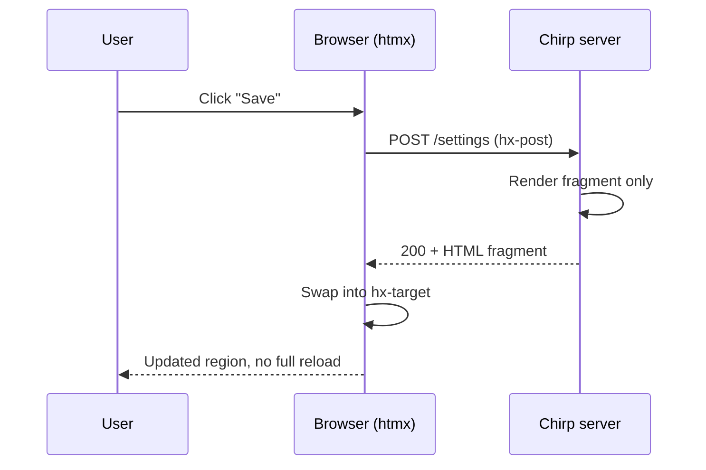

When a chirp-ui form posts with htmx, the server does not re-render the whole
page — it returns just the fragment that changed and htmx swaps it into place.
Here is the round trip.

## The lifecycle

The page never reloads. Only the targeted region is replaced, so scroll
position, focus, and unrelated Alpine state all survive the exchange.

## The attributes that carry the contract

Each htmx-enabled chirp-ui macro emits a small, predictable attribute set. The
ones you reach for most:

| Attribute        | What it does                                   | Typical value            |
| ---------------- | ---------------------------------------------- | ------------------------ |
| `hx-post`        | Sends the request to an endpoint               | `/settings`              |
| `hx-target`      | Element the response replaces                  | `#settings-panel`        |
| `hx-swap`        | How the response is inserted                   | `innerHTML transition:false` |
| `hx-select`      | Narrows which part of the response is used     | `unset` (auto on forms)  |
| `hx-boost`       | Disabled on action links to avoid hijacking    | `false`                  |

The `form()` macro wires `hx-select="unset"` and `hx-disinherit` for you, so a
form dropped inside a boosted layout swaps cleanly instead of pulling the whole
shell back into the panel. That default is the difference between a calm swap
and a page that flickers its entire chrome on every save.

## Out-of-band, when one swap is not enough

Sometimes a single action should update two places — the panel *and* a counter
badge in the header. The `oob_fragment` helper wraps any extra content as an
out-of-band swap so the server can update both regions in one response, without
the client orchestrating anything.
